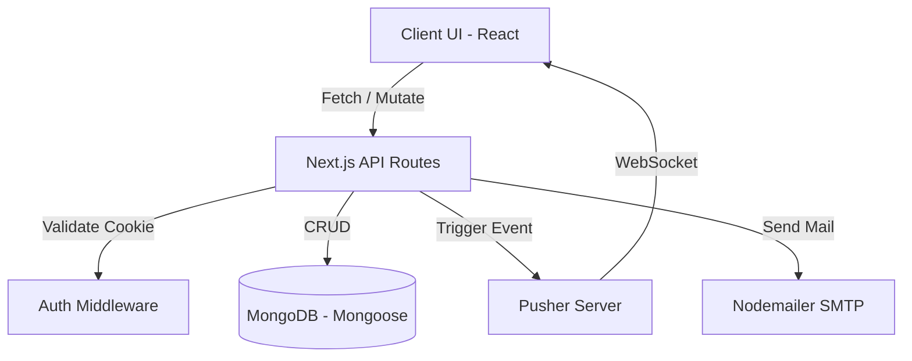
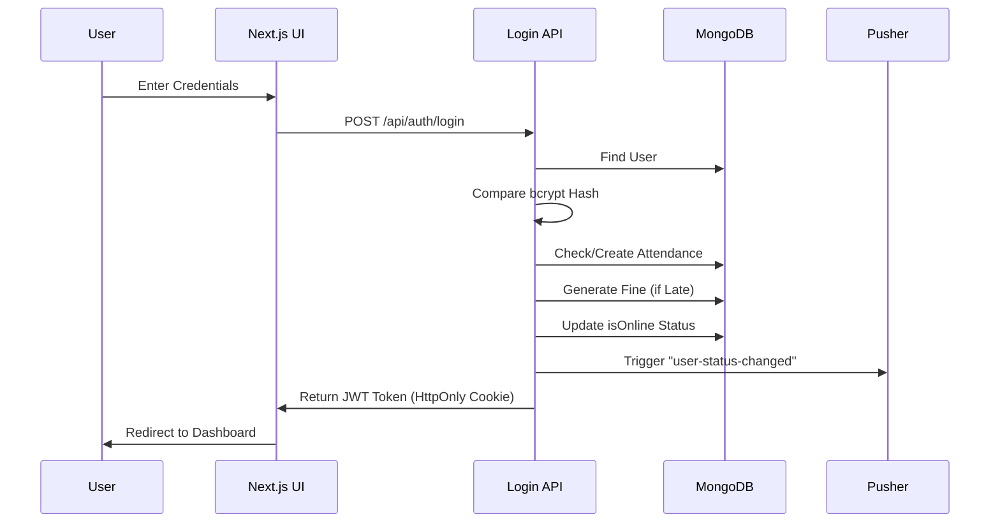
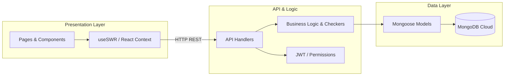

# System Architecture Diagrams

## High-Level Request Lifecycle

```mermaid
graph TD
    Client[Client UI - React] -->|Fetch / Mutate| API[Next.js API Routes]
    API -->|Validate Cookie| Auth[Auth Middleware]
    API -->|CRUD| MongoDB[(MongoDB - Mongoose)]
    API -->|Trigger Event| Pusher[Pusher Server]
    Pusher -->|WebSocket| Client
    API -->|Send Mail| SMTP[Nodemailer SMTP]
```

## Authentication & Check-in Flow

```mermaid
sequenceDiagram
    participant User as User
    participant Frontend as Next.js UI
    participant Backend as Login API
    participant DB as MongoDB
    participant Realtime as Pusher

    User->>Frontend: Enter Credentials
    Frontend->>Backend: POST /api/auth/login
    Backend->>DB: Find User
    Backend->>Backend: Compare bcrypt Hash
    Backend->>DB: Check/Create Attendance
    Backend->>DB: Generate Fine (if Late)
    Backend->>DB: Update isOnline Status
    Backend->>Realtime: Trigger "user-status-changed"
    Backend->>Frontend: Return JWT Token (HttpOnly Cookie)
    Frontend->>User: Redirect to Dashboard
```

## Modular Layer Map

```mermaid
graph LR
    subgraph Frontend [Presentation Layer]
        UI[Pages & Components]
        State[useSWR / React Context]
    end

    subgraph Backend [API & Logic]
        Routes[API Handlers]
        Services[Business Logic & Checkers]
        Auth[JWT / Permissions]
    end

    subgraph Data [Data Layer]
        ODM[Mongoose Models]
        DB[(MongoDB Cloud)]
    end

    UI --> State
    State -->|HTTP REST| Routes
    Routes --> Auth
    Routes --> Services
    Services --> ODM
    ODM --> DB
```
